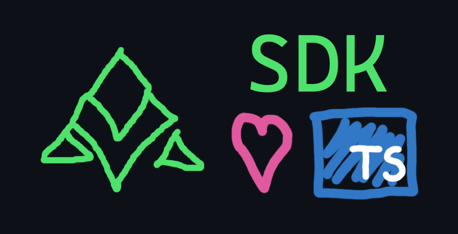

<div align="center">
	
	<br/>
	<i>A sound way to interact with Axel's API!</i>
</div>

```
npm install github:axelapi/pub-ts-sdk
```

```js
const {Client} = require("@axelapi/sdk");
const axel = new Client("axlt-0-ABCDEF");

await axel.connect();
axel.lend({protocol: "aave", amount: .001});
```
